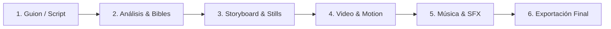

# 🎬 Vidmint — Guía General y Plan de Pruebas

Bienvenido a la plataforma de generación y producción de video impulsada por Inteligencia Artificial de **Vidmint**. Este documento resume la visión general de la plataforma, su arquitectura, funcionalidades clave, catálogo de modelos recomendados por niveles de costo y una guía de pruebas paso a paso.

---

## 📌 1. Descripción General del Proyecto

**Vidmint** es un estudio integral de producción cinematográfica y publicitaria con IA diseñado para convertir ideas, guiones o conceptos en secuencias de video completas con coherencia de personajes, locaciones, estilo visual, animación cinematográfica y audio.

### 🌐 Acceso a la Plataforma (Producción)
* **URL:** [https://openstory.vidmint1.workers.dev](https://openstory.vidmint1.workers.dev)
* **Repositorio de Código:** [github.com/cfarias73/vidmint](https://github.com/cfarias73/vidmint)

---

## 🏗️ 2. Infraestructura y Seguridad

La aplicación opera sobre una arquitectura serverless de ultra-baja latencia y alta escala:

* **Frontend & Backend (SSR):** Cloudflare Workers (TanStack Start + Vite).
* **Base de Datos:** Cloudflare D1 (Base de datos SQLite distribuida globalmente).
* **Almacenamiento de Medios:** Cloudflare R2 (Buckets dedicados para imágenes, videos y assets).
* **Orquestación en Background:** 32 Cloudflare Workflows para procesamiento pesado sin bloqueos.
* **Seguridad y Cifrado:** Cifrado simétrico AES-GCM para llaves de API y cookies de sesión firmadas con BetterAuth.

---

## 🔑 3. Acceso y Autenticación (Login)

La plataforma utiliza autenticación **Passwordless (Códigos OTP de un solo uso)**:

1. **Flujo de Acceso:**
   * El usuario ingresa su correo electrónico en `/login`.
   * El sistema envía automáticamente un código seguro de 6 dígitos vía correo electrónico (con validez de 5 minutos).
   * Al introducir el código, el usuario accede a su panel de control con su equipo y créditos iniciales.
2. **Entorno de Producción Comercial:**
   * La entrega de correos se gestiona mediante **Resend / Cloudflare Email**.
   * *Para habilitar envíos a cualquier dominio global de clientes:* Se añade y verifica el dominio corporativo (ej. `vidmint.com`) en los registros DNS.

---

## ⚡ 4. Módulos y Funcionalidades Principales

### A. Compositor de Guiones y Asistente Creativo
* **Entrada Libre o Guiada:** Escribe una sinopsis, un guion en formato profesional o usa el generador asistido por IA para expandir una premisa.
* **Control de Duración:** Configura la duración objetivo de la pieza (15s, 30s, 60s, 2m, 5m).

### B. Análisis de Escenas y Biblias de Continuidad (Character & Location Bibles)
* **Desglose Automático:** El sistema divide el guion en escenas dramáticas individuales y planos de cámara.
* **Hojas de Personajes y Locaciones:** Genera perfiles visuales consistentes para que los rostros, vestuarios y locaciones se mantengan idénticos en todas las tomas.

### C. Generación de Fotogramas Clave (Stills)
* Renderizado de imágenes de alta fidelidad para cada toma antes de animar.
* Edición, regeneración selectiva y reemplazo de elementos de la toma.

### D. Animación y Generación de Video (Motion)
* Conversión de imagen a video (*Image-to-Video*) con control de movimiento de cámara, físicas naturales y coherencia temporal.
* Soporte para múltiples motores de video líderes de la industria (Fal.ai, Grok Imagine, Google Veo, MiniMax, LTX).

### E. Diseño Sonoro y Música
* Composición de bandas sonoras y efectos ambientales adaptados al tono y emoción de la secuencia.

### F. Edición y Exportación de Secuencias
* Línea de tiempo interactiva para reproducir, reordenar y ensamblar la película completa.
* Exportación en alta resolución (MP4).

---

## 🎯 5. Recomendación de Modelos por Niveles de Costo

La plataforma se conecta a **OpenRouter** (para razonamiento de guion) y **Fal.ai** (para renderizado de imágenes y video). Se recomiendan los siguientes 3 niveles según el objetivo del proyecto:

| Nivel / Tier | Guion & Análisis (LLM) | Generación de Imagen | Generación de Video (Motion) | Costo Est. (Video 30s) | Caso de Uso Ideal |
| :--- | :--- | :--- | :--- | :--- | :--- |
| **🟢 Económico** *(Ultra Low Cost)* | `google/gemini-3.7-flash` o `gpt-5.6-luna` | `google/nano-banana-2-lite` o `nano-banana-2` | `fal-ai/gemini-omni-1.1-flash` o `ltx-2.3` | **~$0.35 – $0.60 USD** | Redes sociales (TikTok, Reels), borradores rápidos y pruebas de volumen. |
| **🟡 Equilibrado** *(Recomendado)* | `anthropic/claude-sonnet-5` | `fal-ai/nano-banana-pro` o `flux-2-max` | `xai/grok-imagine-video/v1.5` o `seedance-2.0` | **~$1.50 – $2.40 USD** | Producciones comerciales, anuncios publicitarios y contenido de marca. |
| **🔴 Top / Cine** *(High-End)* | `anthropic/claude-opus-5` | `openai/gpt-image-2` (4K) o `flux-2-max` | `fal-ai/veo3.1` (Google Veo) o `kling-v3-pro` | **~$4.50 – $7.00 USD** | Comerciales de televisión, trailers cinematográficos y piezas de máxima calidad visual. |

---

## 🧪 6. Plan de Pruebas para el Cliente (Test Plan Paso a Paso)

Sigue esta secuencia para validar el funcionamiento completo de la plataforma:

### Prueba 1: Acceso al Sistema
1. Entra a **[https://openstory.vidmint1.workers.dev/login](https://openstory.vidmint1.workers.dev/login)**.
2. Ingresa tu correo electrónico autorizado y presiona **Continue**.
3. Revisa tu buzón, copia el código de verificación de 6 dígitos e ingrésalo.
4. **Resultado esperado:** Ingreso exitoso al Dashboard con tu balance de créditos activo.

### Prueba 2: Creación de un Guion Rápido
1. En el menú principal, haz clic en **New Sequence** (Nueva Secuencia).
2. Selecciona una duración objetivo de **30 segundos**.
3. Escribe un concepto corto (Ejemplo: *"Un astronauta explora una cueva de cristales luminosos en un planeta alienígena y encuentra un artefacto flotante"*).
4. Haz clic en **Enhance / Generate Script**.
5. **Resultado esperado:** La IA desglosa la historia en escenas con descripciones visuales, personajes y locaciones identificadas.

### Prueba 3: Generación del Storyboard (Imágenes)
1. En la vista de la secuencia, revisa los fotogramas propuestos.
2. Haz clic en **Generate All Images** (o genera una escena individual).
3. **Resultado esperado:** Se renderizan los fotogramas en alta calidad manteniendo el estilo artístico seleccionado.

### Prueba 4: Generación de Video y Movimiento (Motion)
1. Sobre una de las imágenes generadas, haz clic en el botón de **Generate Motion / Video**.
2. Selecciona el modelo de video deseado (ej. *Grok Imagine Video* o *Gemini Omni*).
3. **Resultado esperado:** El sistema procesa la toma en segundo plano y entrega el clip de video animado con movimiento de cámara fluido.

### Prueba 5: Ensamblado y Reproducción
1. Haz clic en el reproductor de secuencia para ver la línea de tiempo completa.
2. Comprueba la sincronización de las tomas y el audio.
3. Haz clic en **Export Video** para descargar la pieza en MP4.
4. **Resultado esperado:** Descarga exitosa del archivo final unificado.

---

*Documento preparado para el equipo de Vidmint.*
